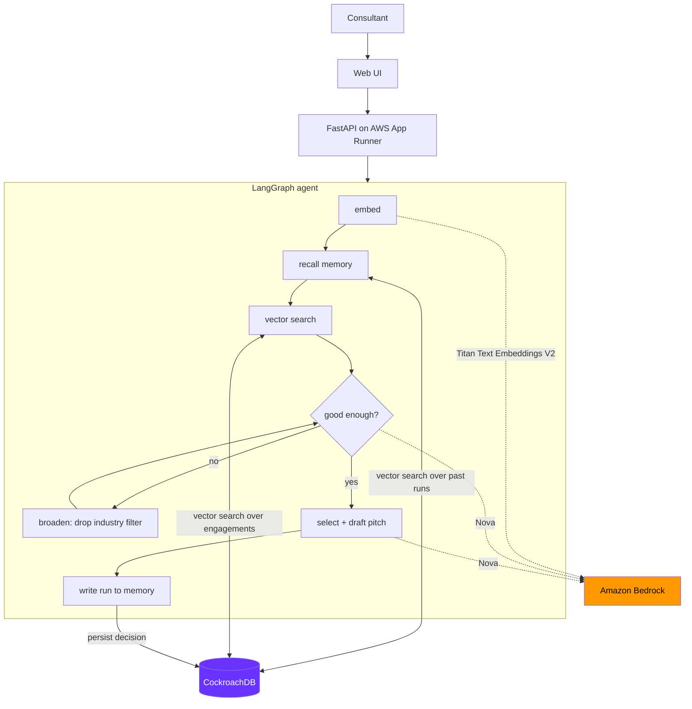

# Case Match

**Agentic institutional memory for consulting firms, built on CockroachDB and AWS.**

Consulting firms run thousands of engagements and forget almost all of them. When a
partner needs the *right* precedent for a new pitch, keyword search fails, because the
engagement that actually matters is often in a different industry entirely. The retail
supply-chain modernization you need might look most like a hospital network's logistics
overhaul.

Case Match is an agent that finds **structural** precedents, explains why they transfer,
drafts the pitch language — and **remembers every case it has ever been asked about**, so
the firm's memory compounds instead of resetting.

---

## Why this is agentic memory, not RAG

The difference is the write path. Most retrieval systems read from a static index. This
agent **reads and writes** its memory on every run:

| | Static RAG | Case Match |
|---|---|---|
| Retrieval | one shot | self-evaluates, re-searches with a **different strategy** if results are weak |
| Memory | read-only corpus | every run persisted to CockroachDB with its query vector |
| Recall | none | vector search over past runs — *"the firm has answered this before"* |
| Learning | none | consultant feedback re-ranks precedents on all future searches |

Ask a second, related question and the agent tells you what the firm decided last time,
and why. That record lives in CockroachDB, so it survives restarts, regions, and failures.

---

## Architecture



**Memory layout in CockroachDB**

| Table | Role | Vector index |
|---|---|---|
| `engagements` | semantic memory — the firm's 47 past engagements | `engagements_embedding_idx` |
| `memory_interactions` | episodic memory — every agent run, with its query vector | `memory_query_embedding_idx` |
| `precedent_feedback` | learned signal — consultant verdicts that re-rank future results | — |

Vectors and transactional records live in **one** database, so ranking and evidence can
never drift out of sync — no separate vector store to reconcile.

---

## CockroachDB tools used

### 1. Distributed Vector Indexing

Two `VECTOR(1024)` columns, each backed by a native CockroachDB vector index using
cosine distance:

```sql
CREATE VECTOR INDEX engagements_embedding_idx
  ON engagements (embedding vector_cosine_ops);

CREATE VECTOR INDEX memory_query_embedding_idx
  ON memory_interactions (query_embedding vector_cosine_ops);
```

The second index is the interesting one. Indexing the *agent's own past questions* is what
makes recall possible: a new case is embedded once, then that single vector searches both
the engagement corpus **and** the agent's history. Ranking blends cosine distance with a
small same-industry bonus and a feedback bonus — deliberately small, so a cross-industry
engagement with a genuinely similar structure can still win. See
[`app/services/retrievals.py`](app/services/retrievals.py).

### 2. Cloud Managed MCP Server

Configured in [`.mcp.json`](.mcp.json) against `https://cockroachlabs.cloud/mcp`.

Used throughout development to design and inspect the memory layer directly from Claude
Code — `list_tables` and `get_table_schema` while shaping the schema, `select_query` to
watch `memory_interactions` fill up during agent runs, and `explain_query` to confirm the
vector indexes were being planned. Read-only by default, which is exactly right for
inspecting a live memory layer: no custom proxy, no risk of an agent mutating the record
it is supposed to be reading.

---

## AWS services used

| Service | Role |
|---|---|
| **Amazon Bedrock — Titan Text Embeddings V2** | Generates the 1024-dim vectors for engagements and incoming cases. One embedding per run, reused for both memory recall and engagement search. |
| **Amazon Bedrock — Nova** | Two reasoning calls: judging whether a candidate set is strong enough (the decision that drives the agent's re-search loop), and selecting the winner + drafting pitch language. |
| **AWS App Runner** | Hosts the containerized FastAPI agent; provides the public HTTPS demo URL. |
| **Amazon ECR** | Stores the container image App Runner deploys. |
| **IAM** | App Runner instance role grants `bedrock:InvokeModel`; no credentials in the image. |

---

## Setup

**Prerequisites:** Python 3.11+, a CockroachDB Cloud cluster, and AWS credentials with
Bedrock access to Titan V2 and Nova.

```bash
git clone <your-repo-url>
cd case-match-agent

python3.11 -m venv .venv
source .venv/bin/activate
pip install -r requirements.txt

cp .env.example .env
# fill in DATABASE_URL and BEDROCK_REGION
```

Build the memory layer and load the corpus:

```bash
python -m scripts.create_tables        # tables + both vector indexes
python -m scripts.load_engagements     # seed engagements from data/engagements.json
python -m scripts.generate_embeddings  # Titan V2 embeddings for each engagement
```

Run it:

```bash
uvicorn app.main:app --reload
# open http://localhost:8000
```

### Verify

```bash
python -m tests.test_connection   # CockroachDB reachable
python -m tests.test_embeddings   # Bedrock returns 1024 dims
python -m tests.test_retrievals   # vector search, correctly ranked
python -m tests.test_agent        # full agent loop, persisted to memory
python -m tests.test_memory       # run 2 recalls run 1  <- the important one
```

`test_memory` is the one that proves the thesis: it runs two related cases and asserts
the second recalls the first out of CockroachDB.

Before recording a demo, `python -m scripts.reset_memory --yes` clears accumulated
development runs. It never touches the engagements table.

---

## API

| Endpoint | Purpose |
|---|---|
| `POST /api/match` | Run the agent on a new case. Returns ranked precedents, per-precedent reasoning, the pitch draft, recalled prior cases, and the full agent trace. |
| `POST /api/feedback` | Record a consultant's verdict on a precedent. Re-ranks it in future searches. |
| `GET /api/memory` | Recent agent runs. |
| `GET /api/stats` | Live memory counters. |
| `GET /health` | Liveness probe. |

---

## Deploy to AWS

```bash
# build and push
aws ecr create-repository --repository-name case-match-agent
docker build -t case-match-agent .
docker tag case-match-agent:latest <acct>.dkr.ecr.<region>.amazonaws.com/case-match-agent:latest
aws ecr get-login-password | docker login --username AWS --password-stdin <acct>.dkr.ecr.<region>.amazonaws.com
docker push <acct>.dkr.ecr.<region>.amazonaws.com/case-match-agent:latest
```

Then create an App Runner service from that image with:

- Port `8080`, health check path `/health`
- Environment variable `DATABASE_URL` (store as a secret)
- An instance role granting `bedrock:InvokeModel`

---

## Project layout

```
app/
  agent/graph.py        LangGraph agent: embed -> recall -> retrieve -> evaluate -> select -> remember
  services/memory.py    the memory layer: recall, write, feedback scoring
  services/retrievals.py vector search + blended ranking
  services/precedent.py Bedrock reasoning: evaluate candidates, draft the pitch
  services/embeddings.py Titan V2 embeddings
  models/               SQLAlchemy models incl. the VECTOR(1024) type
  main.py               FastAPI + demo UI
scripts/                schema, seeding, embedding, memory reset
tests/                  runnable verification scripts
data/engagements.json   the seed corpus
```

## License

MIT — see [LICENSE](LICENSE).
